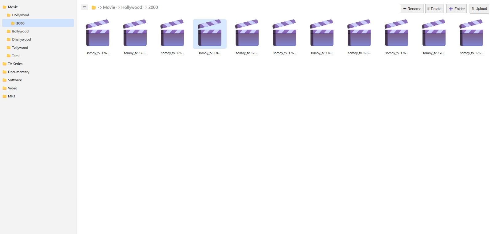
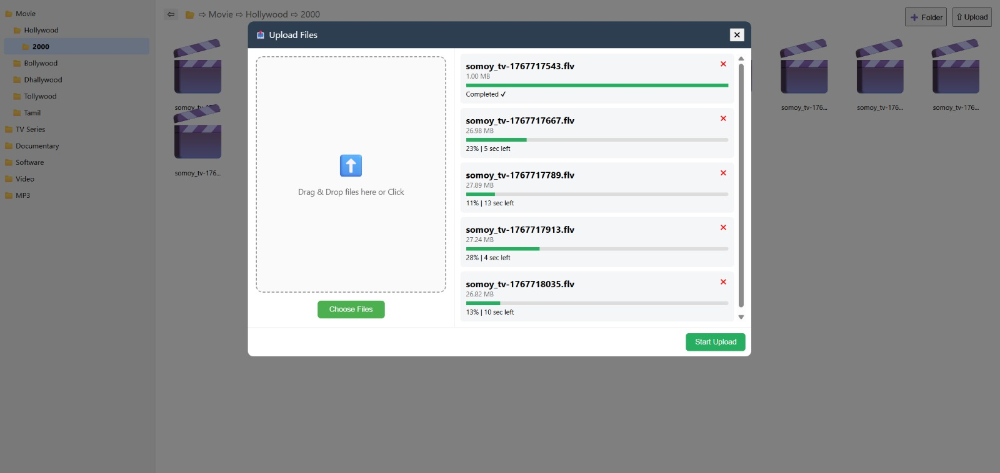
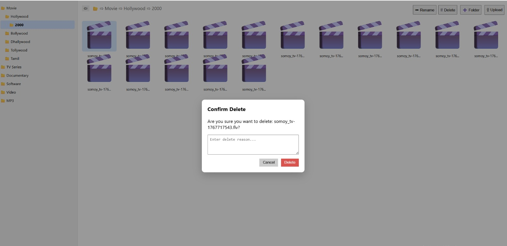
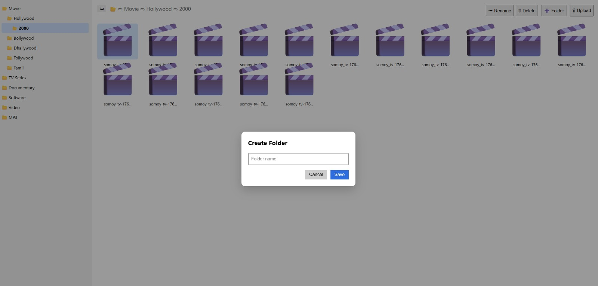

# 🧾 ERP + TUS Server Setup Guide

This project contains:
- Django ERP backend
- TUS file upload server
- Local development setup

---

# 📦 Requirements

- Python 3.10+
- pip (latest recommended)
- PowerShell (Windows)
- Git (optional)

---

# ⚙️ 1. Activate Virtual Environment (Windows PowerShell)

```powershell
.env\Scripts\Activate.ps1
```

If permission error occurs:

```powershell
Set-ExecutionPolicy RemoteSigned -Scope CurrentUser
```

Then run again:

```powershell
.env\Scripts\Activate.ps1
```

---

# 📁 2. Go to ERP Project Folder

```bash
cd .\erp\
```

---

# 🚀 3. Run Django ERP Server

### Default run:

```bash
python manage.py runserver
```

### Run on specific port:

```bash
python manage.py runserver 8000
```

### Run on custom IP + port:

```bash
python manage.py runserver 0.0.0.0:8000
```

---

# 📂 4. TUS File Upload Server Setup

This project uses **tusd (resumable upload server)**.

---

## 🚀 Run TUS Server

### Basic run:

```bash
tusd -upload-dir ./uploads -port 1080
```

---

### Production-style setup:

```bash
tusd -upload-dir ./uploads -port 1080 -base-path /files -behind-proxy -max-size 10737418240
```

---

## 🌐 TUS Server URL

http://127.0.0.1:1080/files

---

# 🔄 Run Both Servers Together

### Terminal 1 (Django ERP)
cd erp
python manage.py runserver 8001

### Terminal 2 (TUS Server)
tusd -upload-dir ./uploads -port 1080

---

# 🌍 Access URLs

- ERP Frontend/Backend: http://127.0.0.1:8000
- TUS Server: http://127.0.0.1:1080/files
- 

---

# ⚠️ Common Issues

## Port already in use
python manage.py runserver 8002

## PowerShell execution error
Set-ExecutionPolicy RemoteSigned -Scope CurrentUser

---

# 👨‍💻 Notes

- Always activate venv before running
- Use separate ports for services


# 🚀 Resumable Upload System Features

## 📤 Core Upload Features
- Single file upload
- Multiple file upload
- Drag & drop upload support
- Folder upload support (optional)
- Chunked upload (file split into parts)
- Resumable upload (pause & resume anytime)

---

## ⏸️ Pause / Resume Features
- Pause upload anytime
- Resume upload from last uploaded chunk
- Auto-resume after network failure
- Manual resume button
- Safe resume after page refresh or reload

---

## 🔄 Reliability & Recovery
- Automatic retry failed chunks
- Exponential backoff retry mechanism
- Network interruption recovery
- Upload session persistence
- Resume upload using upload ID

---

## 📊 Progress Tracking
- Upload progress percentage (%)
- Uploaded size (MB/GB)
- Remaining size display
- Upload speed (KB/s, MB/s)
- Estimated time remaining (ETA)
- Per-file progress tracking (multi-upload)
- Total batch progress

---

## 📁 Multiple File Management
- Upload queue system
- Parallel uploads (configurable concurrency)
- Pause individual file upload
- Resume individual file upload
- Cancel single file upload
- Cancel all uploads
- Reorder upload queue

---

## 🧠 Session Management
- Unique upload session ID per file
- Resume using metadata
- Persistent queue (localStorage / DB)
- Server-side upload state tracking
- Cleanup expired uploads automatically

---

## 🔐 Security & Validation
- File size limit validation
- File type restriction (MIME validation)
- Token/JWT authentication support
- Expiring upload links
- Server-side chunk validation

---

## 🌐 Performance Optimization
- Configurable chunk size (e.g., 5MB – 20MB)
- Parallel chunk upload support
- Adaptive upload speed handling
- CDN support for upload endpoints

---

## 📡 Backend (TUS / Custom Server)
- Upload creation endpoint
- Chunk append endpoint
- Upload offset tracking
- Upload status API
- Upload termination endpoint
- Metadata storage (filename, size, type)

---

## 🧾 UI/UX Features
- Progress bar (individual + total)
- Pause / Resume buttons
- Remaining size display
- Upload speed indicator
- Error display per file
- Retry failed uploads button

---

## 🧹 Maintenance & Cleanup
- Auto-delete incomplete uploads after timeout
- Remove orphan upload sessions
- Logging of completed uploads
- Storage cleanup jobs


# 📂 Folder View



---

# ⬆️ Upload Screen



---

# 🗑️ Delete Action



---

# ➕ Create New

